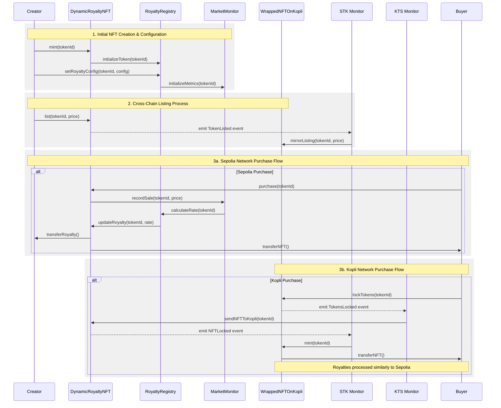

# Dynamic NFT Royalty System Using Reactive Smart Contracts


## 🌟 Problem Statement

The NFT ecosystem currently faces a critical challenge with royalty enforcement and dynamic pricing. Despite creators setting royalty percentages during NFT minting, these rates:

- Are frequently bypassed by marketplaces
- Remain static regardless of market conditions
- Can't adapt to cross-chain sales
- Lead to approximately $1.8B in lost royalties annually

Traditional smart contracts lack the capability to:

- Monitor cross-chain sales autonomously
- Adjust royalty rates based on real-time market conditions
- Enforce royalties across different marketplaces
- Provide creators with transparent tracking of their earnings

## 💡 Solution: Reactive Smart Contracts (RSCs)

Our solution leverages the power of Reactive Smart Contracts to create a dynamic, self-adjusting royalty system that operates autonomously across multiple chains.

### Why Reactive Smart Contracts?

Traditional smart contracts are passive - they only execute when directly called. RSCs, however, can:

- Autonomously monitor blockchain events
- Self-trigger functions based on market conditions
- Operate seamlessly across multiple chains
- Maintain consistent state across networks

This makes them perfect for solving the NFT royalty problem, as they can:

1. Actively monitor sales across different chains
2. Automatically adjust royalty rates based on market conditions
3. Enforce royalty payments across marketplaces
4. Provide real-time tracking and distribution of royalties

## 🏗 Architecture

Our system operates across two networks (Sepolia and Kopli) with four main reactive components:

### Core Smart Contracts

1. **DynamicRoyaltyNFT Contract** (`0x88048DD557Da01563E72B7003505ABF4b6f53844`)
    - Manages NFT minting and transfers
    - Implements ERC721 and ERC2981 standards
    - Handles dynamic royalty calculation and distribution
2. **RoyaltyRegistry Contract** (`0x971fe90E7246A53aeAD002544c5AB827a2b27abC`)
    - Stores royalty configurations
    - Calculates dynamic rates based on market conditions
    - Manages beneficiary information
3. **MarketMonitor Contract** (`0x6E920a818D8eCF03298d754A634c237Fa9BEbC60`)
    - Tracks real-time market metrics
    - Provides data for rate calculations
    - Maintains historical price data
4. **WrappedNFTOnKopli Contract** (`0xe4F0d45c970523a835D06615aCCC50B7778859e0`)
    - Manages cross-chain NFT operations
    - Handles REACT token mechanisms
    - Processes cross-chain purchases

### Reactive Components

1. **Sepolia to Kopli Reactive (STK)**
    - Monitors: TokenLocked, TokenListed, TokenUnlisted events
    - Chain IDs: Sepolia (11155111) → Kopli (5318008)
    - Transaction Hash: `[TXN_HASH_1]`
2. **Kopli to Sepolia Reactive (KTS)**
    - Monitors: TokensLocked events
    - Chain IDs: Kopli (5318008) → Sepolia (11155111)
    - Transaction Hash: `[TXN_HASH_2]`


## 🔄 Complete System Flow

The following sequence diagram illustrates the complete system flow:



This diagram illustrates the three main processes in the system:
1. Initial NFT Creation & Configuration
2. Cross-Chain Listing Process
3. Purchase Flows (both on Sepolia and Kopli networks)


### 1. Initial NFT Creation and Configuration

```solidity
// Step 1: NFT Creation
Creator → DynamicRoyaltyNFT.mint(tokenId)
↓
DynamicRoyaltyNFT → RoyaltyRegistry.initializeToken(tokenId)

// Step 2: Royalty Configuration
Creator → RoyaltyRegistry.setRoyaltyConfig(tokenId, config)
↓
RoyaltyRegistry → MarketMonitor.initializeMetrics(tokenId)

```

### 2. NFT Listing Process

```solidity
// Initial Listing
Creator → DynamicRoyaltyNFT.list(tokenId, price)
↓
Event: TokenListed
↓
STK Monitor → WrappedNFTOnKopli.mirrorListing(tokenId, price)

```

### 3. Purchase Flows

### Sepolia Network Purchase

```solidity
// Primary Network Purchase
Buyer → DynamicRoyaltyNFT.purchase(tokenId)
↓
MarketMonitor.recordSale(tokenId, price)
↓
RoyaltyRegistry.calculateRate(tokenId)
↓
DynamicRoyaltyNFT.updateRoyalty(tokenId, rate)
↓
Payment Distribution (Seller + Creator)

```

### Kopli Network Purchase

```solidity
// Cross-chain Purchase
Buyer → WrappedNFTOnKopli.lockTokens(tokenId)
↓
Event: TokensLocked
↓
KTS → DynamicRoyaltyNFT.sendNFTToKopli(tokenId)
↓
Event: NFTLocked
↓
STK → WrappedNFTOnKopli.mint(tokenId)

```


## 🚀 Impact & Benefits

### For Creators

- Up to 40% increase in royalty collection
- Real-time market-adjusted rates
- Automated cross-chain earnings
- Complete visibility of sales and earnings

### For Buyers

- Transparent fee structure
- Potential rewards for high-volume trading
- Reduced gas costs through batching
- Clear provenance tracking

### For Marketplaces

- Simplified implementation
- Automated compliance
- Lower operational costs
- Competitive advantage

## 🔒 Security Features

- Owner-only functions for critical updates
- Reactive contract validation
- Cross-chain message verification
- Safe transfer mechanisms
- Reentrancy protection


### Frontend Integration

The system includes a React-based frontend that provides:

- Creator dashboard for NFT management
- Real-time market metrics visualization
- Cross-chain transaction tracking
- Royalty analytics and reporting

## 🔗 Contract Addresses

### Sepolia Network

- DynamicRoyaltyNFT: `0x88048DD557Da01563E72B7003505ABF4b6f53844`
- RoyaltyRegistry: `0x971fe90E7246A53aeAD002544c5AB827a2b27abC`
- MarketMonitor: `0x6E920a818D8eCF03298d754A634c237Fa9BEbC60`
- IPFSHashStorage: `0xb0Bb615E83f267131614507D45dB970cE03c7886`

### Kopli Network

- WrappedNFTOnKopli: `0xe4F0d45c970523a835D06615aCCC50B7778859e0`
- React: `0xD5eBcF0eD20A9090528038Efb91fF3D4C2deAa83`

## 🚀 Getting Started

1. Clone the repository
    
    ```bash
    git clone https://github.com/harshkas4na/Dynamic-Royalty.git
    
    ```
    
2. Install dependencies
    
    ```bash
    npm install
    
    ```
    
3. Start frontend
    
    ```bash
    npm run dev
    
    ```
    

## 🔒 Security Considerations

The system implements multiple security measures:

- Owner-only functions for critical updates
- Reactive contract validation
- Cross-chain message verification
- Safe transfer mechanisms
- Reentrancy protection

## 🔄 Verification

All smart contracts are verified on:

- Sepolia Explorer: `https://sepolia.etherscan.io/`
- Kopli Explorer: `https://kopli.reactscan.net`

## 📈 Future Enhancements

1. Technical Improvements
    - Layer 2 scaling integration
    - Including More networks like Kopli
    - Cross-chain message optimization
    - Enhanced market metrics
2. Feature Additions
    - DAO governance integration
    - Advanced pricing models
    - Additional market indicators

## 🤝 Contributing

We welcome contributions! Please see our [Contributing Guidelines](https://www.notion.so/CONTRIBUTING.md) for details.

## 📄 License

This project is licensed under the MIT License - see the [LICENSE](https://www.notion.so/LICENSE) file for details.
